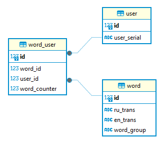

# Telegram bot 

## Bot description
The bot is suggesting to user a words on RUS and different variants of ENG translation.
There are different categories of words to be chosen. 

The bot is provided user to add words to personnel user list. The words can also be deleted out of personnel list. The list of added words is personnel for each user.

## How to start
The bot is available by link https://t.me/alex_general_bot
To start the bot enter command /start in chat.

## Code documentation
The bot has database. The base consists of three joint tables:
user - to store general information of users
word - to store words to be learned
word_user - to store data of personnel list of words for dedicated user

Here is database scheme:

When user starts chat with bot, data of user is automatically added to database. 
